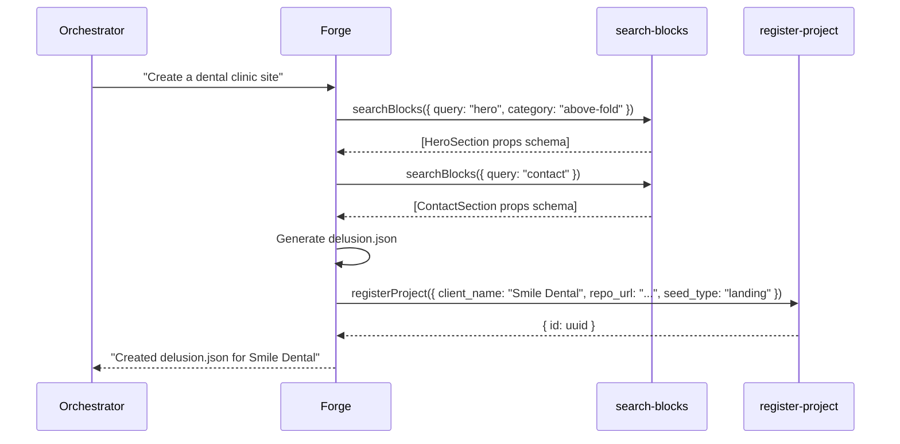

# Design: Forge Agent

## Architecture Overview
The Forge agent is a Mastra agent initialized with the tier clamped by the global `CostMode`. Internally, it is responsible for the pure synthesis of `delusion.json` schema from client requests.

### Core Workflow
1. **Input**: Natural language request (e.g. "Minimalist photography portfolio using dark mode").
2. **Analysis**: The Forge agent decides what components it needs.
3. **Execution**: It fires the `search-blocks` tool to discover available sections in `@delusion/blocks`.
4. **Output Synthesis**: It generates the `delusion.json` structure natively or through an exposed schema.
5. **Persistence**: Calls `register-project` (Supabase tool) to persist the new site in the active registry.

## Sequence Diagram

## Prompt Engineering Strategy
The Forge agent's `instructions` (System Prompt) MUST contain:
- Strict directives to NEVER emit HTML/CSS/JS.
- Directives to use the `search-blocks` tool as its primary vision into the design system.
- An explanation of the `@delusion/blocks` UI configuration file logic (`delusion.json`).

## Testing & Confidence
Before rolling to production, we must test the Forge locally using a mock orchestrator call to ensure that the free tier model (like Gemini / Llama) accurately respects the JSON outputs without injecting conversational markdown fluff around the actual `delusion.json` schema. In Mastra, we can enforce `schema` in the agent's response to guarantee JSON structure safely.
